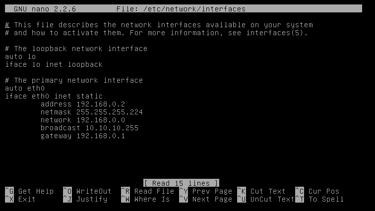
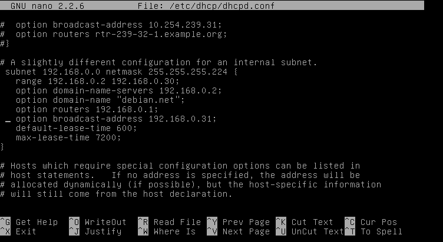
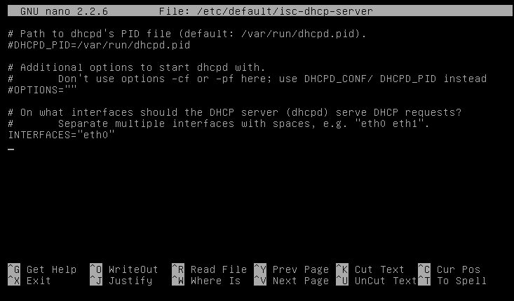
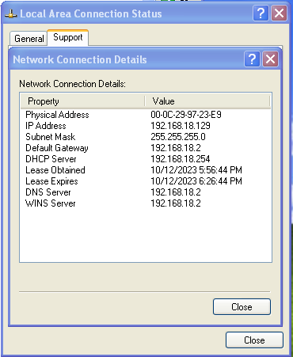

# DHCP Project

## Documentasi Debian (DHCP Server)
### Cara Install dan Konfigurasi DHCP Server Di Debian 7

## 1.Install Server DHCP
Buka Terminal dan jalankan perintah dengan command
```
sudo apt install isc-dhcp-server
```

## 2.Konfigurasi IP
Setelah sudah menginstall,Selanjutnya Konfigurasi IP pada debian hanya dapat dilakukan menggunakan super user atau root konfigurasi ini berada pada file /etc/network/interfaces.
Untuk mengkonfigurasi IP anda bisa menggunakan command/script
```
nano /etc/network/interfaces
```



## 3.Konfigurasi DHCP Server
Selanjutnya anda perlu mengkonfigurasi DHCP Server dengan command
```
nano /etc/dhcp/dhcpd.cof
```
Di dalam konfigurasi,Anda harus menentukan konfigurasi dan subnet IP yang diberikan oleh server DHCP.


## 4.Konfigurasi Ethernet
Jika dalam computer anda terdapat dua atau lebih Ethernet. Maka harus dipastikan, Ethernet mana yang akan mendapatkan layanan DHCP Server. untuk itu, cara edit file default dhcp seperti berikut.
```
nano /etc/default/isc-dhcp-server
```



## 5.Restart DHCP Server
Lalu setelah anda mengkonfigurasi DHCP Server selanjutnya anda harus restart layanan menggunakan command 
```
service isc-dhcp-server restart.
```

Lalu yang terakhir anda dapat memulai pengujian dengan menghubungkan perangkat ke jaringan dan memeriksa apakah client menerima alamat IP dari server DHCP



Terima Kasih telah melihat langkah-langkah dasar untuk menginstall dan mengkonfigurasi server DHCP di debian.

# Semoga yang saya berikan bermaanfaat sekian Terima kasih.
